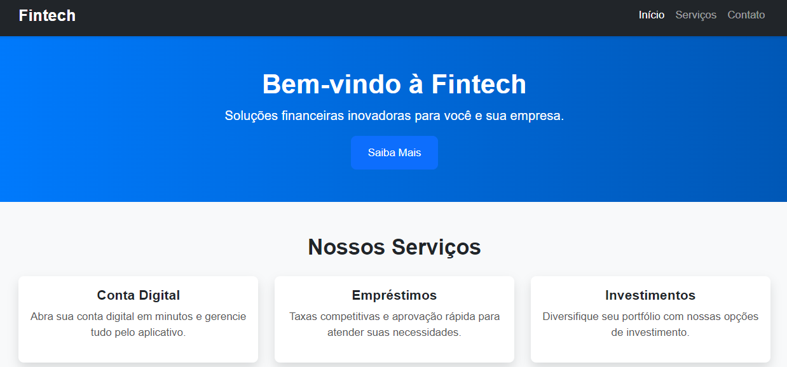

# **Projeto Fintech**

## Este projeto é uma fintech simples, desenvolvida utilizando as tecnologias HTML e CSS, com o objetivo de criar uma interface intuitiva e de fácil navegação. Embora tenha um conjunto de funcionalidades reduzido, o foco principal é proporcionar uma experiência acessível para aqueles que buscam soluções para melhorar sua saúde financeira.

## O projeto foi idealizado para ajudar novos clientes a entenderem melhor suas finanças pessoais e a tomarem decisões mais informadas, com a promessa de oferecer uma experiência simples e agradável.

# **Objetivo:**

## O propósito deste projeto é atrair novos usuários, oferecendo um design clean e moderno, aliado a uma navegação intuitiva. Ele busca fornecer ferramentas e informações essenciais para ajudar os clientes a lidarem com suas dificuldades financeiras de maneira eficiente e prática.

# **Funcionalidades:**

### Interface minimalista, focada na facilidade de uso.

### Design responsivo, adaptável a diferentes tamanhos de tela.

### Exibição de informações claras e acessíveis para o usuário.

# **Pré-visualização:**

## Abaixo, você pode conferir a pré-visualização do layout, onde destacamos o design e a estrutura da interface.

